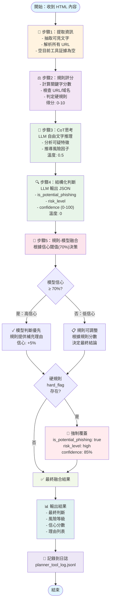
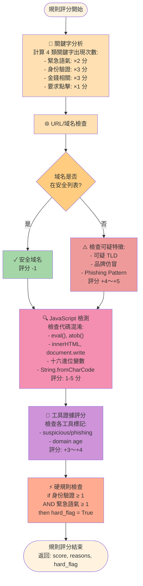
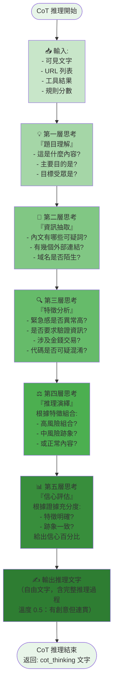
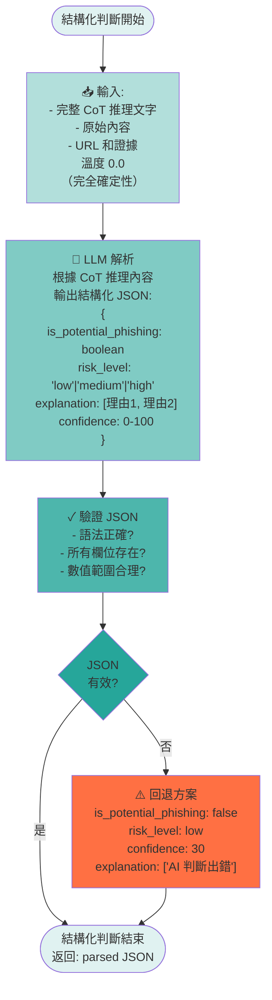
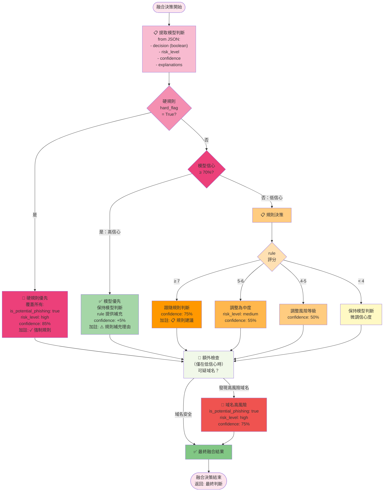

# Chain-of-Thought (CoT) 流程圖

本文檔展示蝸牛檢測系統的 CoT 邏輯流程。

---

## 🎯 整體 CoT 分析流程（高層次）



---

## 📋 詳細流程：規則評分（步驟2）



---

## 💭 詳細流程：Chain-of-Thought（步驟3）



---

## 🔍 詳細流程：結構化判斷（步驟4）



---

## 🔀 詳細流程：規則-模型融合決策（步驟5）



---

## 📊 決策矩陣：信心 vs 規則評分

```
┌─────────────────┬────────────────────┬────────────────────┬────────────────────┐
│ 模型信心 / 規則 │     規則 ≤ 3       │    規則 4-6        │      規則 ≥ 7      │
├─────────────────┼────────────────────┼────────────────────┼────────────────────┤
│  high (≥ 70%)   │ ✅ 信任模型        │ ✅ 信任模型        │ ⚠️ 規則補充理由   │
│                 │ conf: 保持         │ + 規則補充       │ conf: +5%         │
├─────────────────┼────────────────────┼────────────────────┼────────────────────┤
│  low (< 70%)    │ ✓ 保持低風險      │ 📋 調整 medium    │ 🔀 跟隨規則       │
│                 │ conf: 保持         │ conf: 55%         │ conf: 75%         │
└─────────────────┴────────────────────┴────────────────────┴────────────────────┘

硬規則 hard_flag = true 時：無視所有上述邏輯，強制 high risk + 85% conf
```

---

## 🔄 完整範例：一份蝸牛檢測分析流程

### 輸入：可疑郵件 HTML

```html
<body>
  <p>親愛的客戶，您的帳戶已被鎖定。請立即點此驗證您的身份，否則您的帳戶將被永久關閉。</p>
  <a href="https://verify-account-secure.xyz/login">驗證帳戶</a>
</body>
```

### 執行流程

```
1️⃣ 提取資訊
   ├─ 可見文字: "親愛的客戶, 帳戶已被鎖定, 立即點此驗證..."
   ├─ URL: ["https://verify-account-secure.xyz/login"]
   └─ 工具結果: {} (暫時停用)

2️⃣ 規則評分
   ├─ 緊急語氣: "立即" ×1 → +2 分
   ├─ 身份驗證: "驗證身份" ×1 → +3 分
   ├─ 域名檢查: verify-account-secure.xyz
   │  └─ 可疑 TLD (.xyz) → +4 分
   │  └─ Phishing pattern ("verify-account") → +5 分
   ├─ hard_flag: 身份驗證 ≥1 AND 緊急語氣 ≥1 → TRUE
   └─ 最終評分: 2+3+4+5 = 14 分 (clamped to 10+) ⚡ hard_flag

3️⃣ CoT 推理（温度 0.5）
   推理文字:
   "
   這份內容看起來像是一份登入驗證通知。
   
   關鍵信號：
   - 使用了『立即』『永久關閉』等強烈緊急語氣
   - 要求用戶『驗證身份』，這是蝸牛常見的社交工程手法
   - 連結指向 verify-account-secure.xyz，一個陌生域名
   - .xyz TLD 是廉價域名，常被蝸牛利用
   - 域名名稱包含『verify-account-secure』，模仿正規銀行/平臺
   
   綜合判斷：這極有可能是蝸牛郵件。信心: 95%
   "

4️⃣ 結構化判斷（温度 0.0）
   JSON:
   {
     "is_potential_phishing": true,
     "risk_level": "high",
     "confidence": 95,
     "explanation": [
       "緊急語氣 + 身份驗證要求",
       "可疑域名: verify-account-secure.xyz",
       "Phishing pattern 偵測到"
     ]
   }

5️⃣ 規則-模型融合
   ├─ 模型信心: 95% ≥ 70% → 高信心
   ├─ hard_flag: TRUE → 強制執行
   └─ 最終決策:
       is_potential_phishing: TRUE ✓ (hard_flag override)
       risk_level: HIGH
       confidence: 85% (hard_flag 強制設定)
       explanations: [
         "✓ 規則判定：身份驗證+緊急語氣（強制優先）",
         "緊急語氣 + 身份驗證要求",
         "可疑域名: verify-account-secure.xyz",
         "Phishing pattern 偵測到"
       ]

📝 日誌記錄:
   {
     "time": "2025-12-04T12:34:56Z",
     "phase": "final",
     "rule": {"score": 14, "hard_flag": true, ...},
     "cot_thinking": "推理文字...",
     "llm_raw": "JSON 原始輸出...",
     "final": {...最終決策...},
     "elapsed": 2.345
   }
```

---

## 📐 架構說明

| 流程步驟 | 組件 | 輸入 | 輸出 | 溫度 | 用途 |
|---------|------|------|------|------|------|
| 1 | 提取 | HTML | 可見文字, URL | - | 資訊標準化 |
| 2 | 規則評分 | 文字, URL | 評分, hard_flag | - | 快速風險評估 |
| 3 | CoT 推理 | 文字, URL, 規則分數 | 推理文字 | 0.5 | 自由推理，富有變化 |
| 4 | 結構化判斷 | 文字, URL, CoT | JSON | 0.0 | 確定性輸出 |
| 5 | 融合決策 | JSON, 規則分數, hard_flag | 最終判斷 | - | 邏輯整合 |

---

## 🎓 CoT 的優勢

1. **透明性**：每一步推理都可見，易於調試和改進
2. **魯棒性**：即使單個信號模糊，多層推理可互相驗證
3. **可解釋性**：用戶可看到 AI 如何思考
4. **避免誤判**：信心低時，規則可提供第二層驗證
5. **適應性**：温度控制讓推理既準確又不過於死板

---

## 📝 註記

- 本系統目前 **tools 呼叫已停用**，所以 `evidence` 為空 dict
- 若要恢復工具呼叫，取消註解 `analyzer.py` 中的 `from tools import ...` 並恢復 `TOOL_REGISTRY`
- 所有決策及中間步驟都記錄在 `planner_tool_log.jsonl`，方便離線分析
- CoT 方法適合高風險決策；若只需快速判斷，可跳過步驟 3（推理），直接進行結構化判斷
